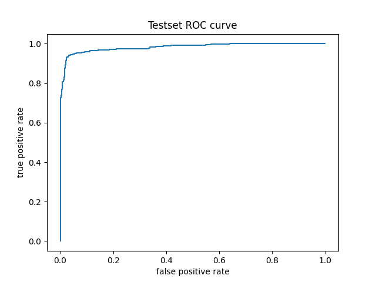
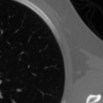
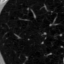
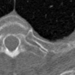
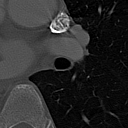

# Lung Nodule Detection
使用 3D Vision Transformer (ViT) 通过 end-to-end training 从 CT images 中检测 lung nodules。模型在 Luna16 dataset（包含 888 CT scans）上训练。下面是一个典型的数据点。


## 项目结构
```
LungNoduleDetection
├── README.md
├── LICENSE
├── dataset.py
├── model.py
├── model_config.json
├── train.py
├── eval.py
├── eval.ipynb
├── datasets
│   └── luna16
│       ├── annotations_excluded.csv
│       ├── annotations.csv
│       ├── candidates.csv
│       ├── sampleSubmission.csv
│       ├── seriesuids.csv
│       ├── subset0
│           ├──1.3.6.1.4.1.14519.5.2.1.6279.6001.105756658031515062000744821260.mhd
│           ├──1.3.6.1.4.1.14519.5.2.1.6279.6001.105756658031515062000744821260.raw
│           └──……
│       ├── subset1
│       ├── ……
│       └── seg-lungs-LUNA16
└── evaluationScript
    └── annotations
        ├── annotations.csv
        └── annotations_excluded.csv
```

## Data processing
数据已经以 metaImage format 存储，可以在 runtime 加载和处理。使用 `dataset.preprocess()` 把 raw files 转成 npy files 以便更快加载。
preprocessing 过程很简单：images 随机裁成 size 为 [40,128,128] 的 patches，进行 normalized，并随机 flipped。dataset 被分成 10 个 subsets，其中 1 个被保留为 testing。


## 项目复现
1. 安装依赖（Python 环境）
```
pip install torch transformers scikit-learn SimpleITK pillow tqdm
```

2. 准备 Luna16 dataset（目录中需包含 `annotations.csv`、`subset0` 到 `subset9`）
```
mkdir -p datasets/luna16
ls datasets/luna16
```

3. 预处理为 npy（生成 `subset*_npy`）
```
python -c "from dataset import preprocess; preprocess('datasets/luna16')"
```

4. 训练模型（默认使用 `datasets/luna16`，输出到 `luna-train/412`）
```
python train.py
```

5. 评估与导出结果（确保 `eval.py` 的 `model_path` 指向你的 checkpoint）
```
python eval.py
```

## Results
model 按 `model_config.json` 和 `train.py` 的设置训练 100k steps。最终 training loss 为 0.0478，test accuracy=0.93，test iuo=0.276，test auc=0.985。testset ROC 如下所示。



下面展示一组精选的 bounding box predictions，并与 ground truth 对比。model 在 nodule 靠近 pleura 或尺寸较小时，难以精确框出 nodule。尽管如此，它仍能大致指示应该关注的位置。

Predicted Bounding Boxes: 



Ground Truth Bounding Boxes:


详见 `eval.ipynb`。checkpoint权重文件 可在此处下载 [Huggingface](https://huggingface.co/Hiwebsun0914/LungNoduleDetection)
